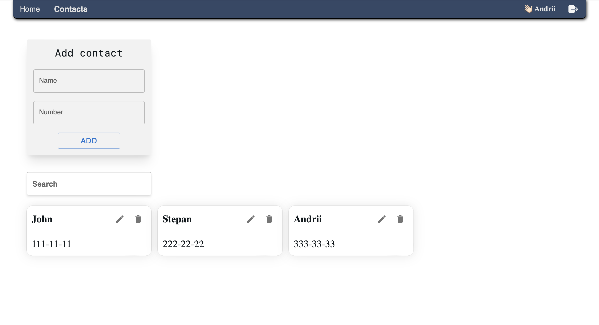

# 🚀 Project Spotlight: Upgraded Phonebook App 🚀

I am thrilled to unveil the latest version of our Phonebook app, designed for anyone looking to securely store contact numbers. With a focus on user-friendly experience and enhanced features, this app ensures your contacts are kept in a safe and accessible place.

Join this journey and enjoy a sleek UI that accompanies you every step of the way. 🙌

## Screenshots

## 🌟 Features:

- Easy Login and Registration 🫵: Seamlessly create an account and get started.
- Contact Management ✍️: Effortlessly add and edit contacts using our intuitive forms.
- Secure Deletion 🤷: Delete contacts with a confirmation step to prevent accidental loss.
- Advanced Search 🔍: Quickly find contacts by name or number.
- State Management with Redux 🏛️: Robust and efficient state management.
- Backend Interaction via Swagger 📀: Smooth and reliable contact and auth storage.
- REST API Integration 🔗: Efficient communication between the client and server.
- Organized Component Structure 🏛️: Streamlined and efficient architecture.
- Clean Code with Prettier 🧼: Code that’s neat and easy to understand.

## Tech Stack

**Client:** React, Redux, Redux Toolkit, JavaScript, MaterialUI, Axios, REST API, Vite

**Server:** Swagger

## 🔥 Quality Assurance:

- Error-Free Console ❌: Enjoy a seamless experience with no console errors.
- Readable Code 📚: Clean and comprehensible codebase for easy maintenance and updates.

## Run Locally

- Clone the project
- npm i : to install all dependencies
- npm run : dev to run the project

## Author

- [@andrewwwmatsko](https://github.com/andrewwwmatsko)
